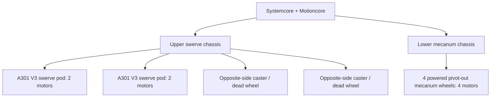

# A301 Full Hybrid Chassis

> [!NOTE]
> This folder documents the full A301 prototype chassis used for Systemcore, Motioncore, and A301 testing. The chassis combines an upper swerve section with a lower mecanum section in one experimental platform.

## ▶ Full Chassis Prototype Video

> **This is a video preview.** Click the image to play it. To keep this page open, use **Ctrl+click** (Windows/Linux), **Cmd+click** (macOS), or middle-click to open the video in a new tab.

## At a Glance

| Area | Detail |
| --- | --- |
| Project | A301 full hybrid chassis |
| Prototype status | Approximately 80% complete |
| Upper drivetrain | Two current A301 V3 swerve pods, plus two passive caster/dead wheels |
| Lower drivetrain | Four powered, pivot-out mecanum wheels |
| Motor allocation | Four A301 motors for swerve + four A301 motors for mecanum = eight total |
| Controls | Systemcore and Motioncore |
| Structure | goBILDA channel, plates, and hardware |
| Current prototype panels | Temporary wood/MDF substitutes for final cut panels |
| Passive wheels | Two casters on the upper swerve section, opposite the two powered swerve pods |
| CAD status | Design-reference renders included; final CAD package is not yet released |

## Chassis Architecture

### Upper Swerve Section

The upper portion of the robot uses two instances of the current **A301 V3 swerve module**, which is documented on the main page of the neighboring [`A301 Swerve Module`](../A301%20Swerve%20Module/) folder. Each pod uses two A301 motors—one for wheel drive and one for steering—so the two swerve pods use four motors altogether.

Two passive caster wheels sit on the opposite sides of the upper swerve section from the powered pods. These casters are the chassis's **dead wheels**: they support the swerve section and roll freely but do not provide drive or steering force. The dead wheels are present on the physical prototype but were not accounted for in the CAD, so they do not appear in the CAD renders.

### Lower Mecanum Section

The lower portion is a complete A301-powered mecanum chassis. It has four mecanum wheels, each driven by its own A301 motor, for a total of four motors in the lower drivetrain. The wheel assemblies can also pivot outward, as shown in the extended-wheel CAD view below. There are no dead wheels in the mecanum section.

Mecanum was intentionally retained as a testing option for FTC students adopting Systemcore. Many FTC students already know mecanum drivetrains built around brushed motors, a Control Hub, and an Expansion Hub, so this lower drivetrain provides a more familiar and accessible starting point for testing the new control system.

## Motor Allocation and Prototype Tradeoff

| Section | Configuration | A301 motors |
| --- | --- | ---: |
| Upper swerve | Two pods; one drive and one steering motor per pod | 4 |
| Lower mecanum | Four independently powered mecanum wheels | 4 |
| **Total** | All motors supplied for the prototype | **8** |

Eight motors were available for the complete robot. Four were reserved for the full mecanum drivetrain so teams could test a familiar FTC drive style. That left four motors for the upper drivetrain—enough for two complete two-motor swerve pods, but not enough for additional powered swerve pods. The two opposite positions on the swerve section therefore use passive casters in the physical prototype.

## Prototype Status

The prototype is about **80% complete**. The main structure is assembled and the combined layout is working as the basis for testing. The current physical chassis is not yet a final implementation of the CAD:

- Some final panels still need to be cut and fitted.
- Wood/MDF pieces are temporarily standing in for those final panels.
- Packaging, cable routing, and structural details will be refined after the replacement panels are installed.
- The CAD should be treated as the intended architecture and a design reference while the physical prototype is improved.
- A final STEP export and Fusion 360 archive will be added after the design is ready to release.

## Full CAD Views

The render above shows the intended combined configuration: the V3 swerve section is mounted above the mecanum base, with Systemcore and Motioncore integrated into the central chassis.

## Prototype Detail Photos

| View | Image |
| --- | --- |
| Full robot / cover view | [Open full resolution](images/full-chassis-prototype-cover.jpg) |
| Systemcore and Motioncore wiring | [Open full resolution](images/systemcore-motioncore-wiring.jpg) |
| Upper-section passive caster/dead wheel | [Open full resolution](images/passive-caster-wheel.jpg) |
| Mecanum pod and lower-frame interface | [Open full resolution](images/mecanum-pod-detail.jpg) |
| Upper swerve assembly, front view | [Open full resolution](images/upper-swerve-front.jpg) |

  
  
  

## Files

| File | Purpose |
| --- | --- |
| [`README.md`](README.md) | Chassis overview, architecture, prototype status, and build notes |
| [`images/full-chassis-prototype-cover.jpg`](images/full-chassis-prototype-cover.jpg) | Full physical robot and cover image |
| [`images/systemcore-motioncore-wiring.jpg`](images/systemcore-motioncore-wiring.jpg) | Controls and wiring reference |
| [`images/passive-caster-wheel.jpg`](images/passive-caster-wheel.jpg) | Upper swerve section's passive caster/dead-wheel detail |
| [`images/mecanum-pod-detail.jpg`](images/mecanum-pod-detail.jpg) | Mecanum pod and chassis interface |
| [`images/upper-swerve-front.jpg`](images/upper-swerve-front.jpg) | Upper swerve assembly detail |
| [`images/cad-full-chassis.png`](images/cad-full-chassis.png) | Full hybrid chassis CAD render |
| [`images/cad-upper-swerve-section.png`](images/cad-upper-swerve-section.png) | Upper swerve section CAD render |
| [`images/cad-lower-mecanum-section.png`](images/cad-lower-mecanum-section.png) | Lower mecanum section CAD render |
| [`images/cad-mecanum-wheel-out.png`](images/cad-mecanum-wheel-out.png) | Mecanum chassis with an extended wheel pod |

## Build Notes

- The full chassis is an experimental integration platform for Systemcore, Motioncore, A301 motors, the V3 swerve module, and the mecanum base.
- The lower mecanum chassis has four powered wheels; none of its wheel positions uses a passive caster.
- The two caster/dead wheels belong to the upper swerve section and are not represented in the current CAD renders.
- The current physical build is intentionally documented alongside the CAD so that prototype substitutions and remaining work are visible.
- CAD source files will be published here once the remaining physical revisions are incorporated.
