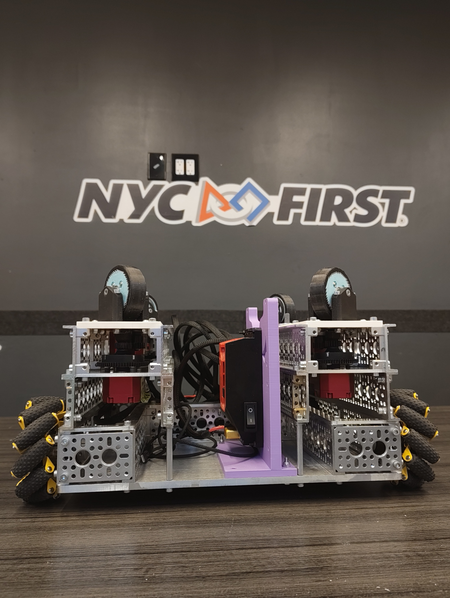
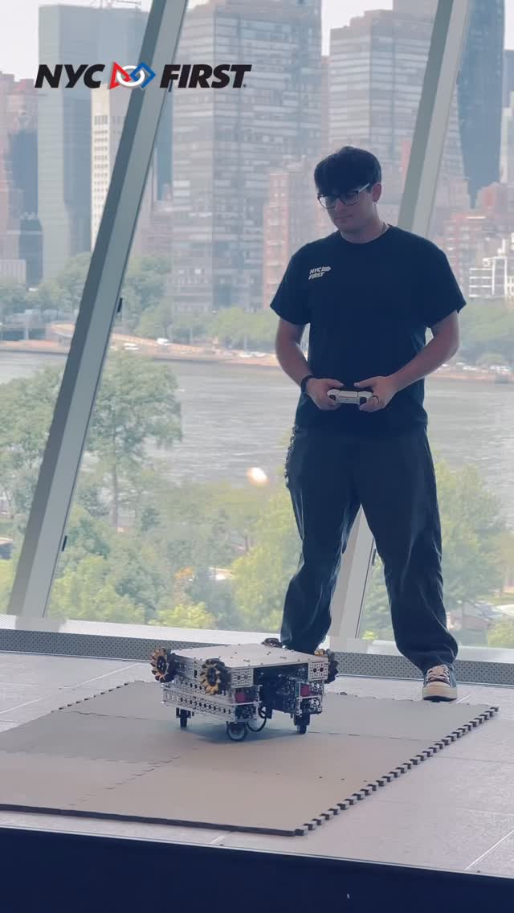
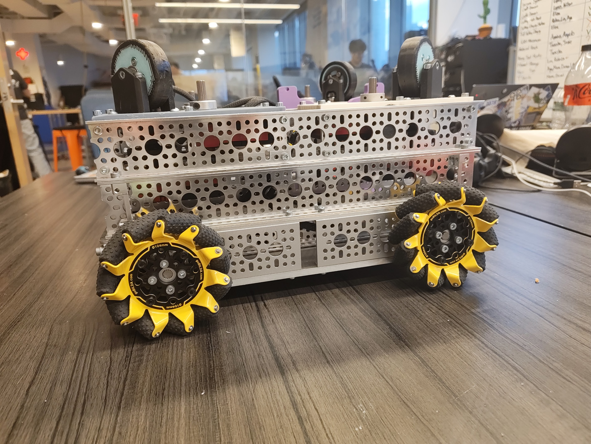
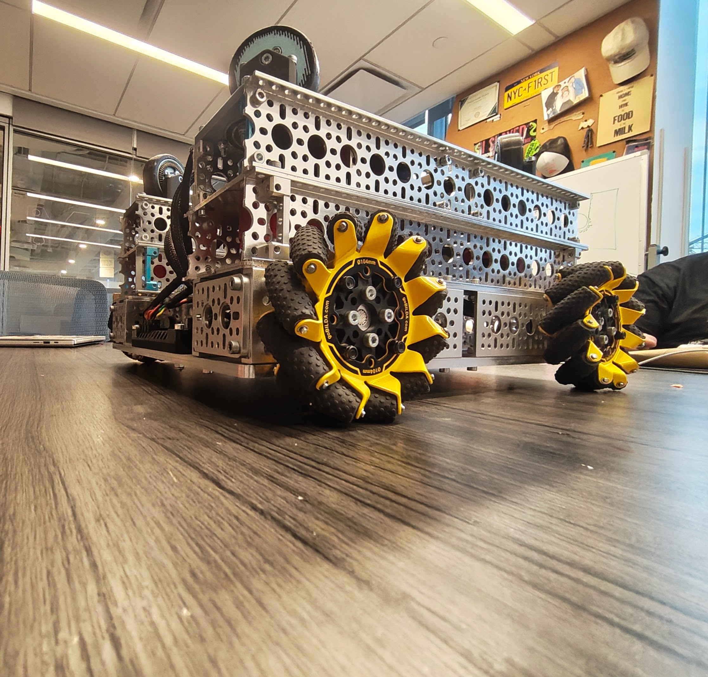

# A301 Swechanum Chassis

### Final four-pod swerve robot on a passive mecanum support base

The final integrated robot developed from the mecanum base, custom swerve pods, and six weeks of Systemcore testing.

[Watch the final robot](#final-robot-video) | [Review the architecture](#current-chassis-architecture) | [View the CAD reference](#cad-reference) | [Back to CAD Models](../)

---

## Final Robot Video

> **Click the preview to watch the Instagram Reel.** The video shows the final four-pod robot using eight A301 motors and the completed swerve drive code.

## Project Overview

The A301 Swechanum chassis is the final integrated robot from the internship. It combines four powered A301 V3 swerve pods with the lower mecanum structure developed earlier in the project.

The current robot is driven entirely by the upper swerve assembly. Each of the four pods uses one A301 drive motor and one A301 steering motor, for eight powered motors total. The four lower mecanum wheels remain attached as passive support wheels and use zero motors.

| Chassis specification | Final configuration |
| --- | --- |
| Control hardware | Systemcore and Motioncore |
| Powered swerve pods | Four A301 V3 modules |
| Drive motors | Four A301 motors |
| Steering motors | Four A301 motors |
| Total powered motors | Eight |
| Passive casters | Zero |
| Lower support wheels | Four mecanum wheels |
| Lower mecanum motors | Zero |
| Structure | Metal goBILDA channel, plates, and hardware |
| Final development stage | Week 6 |

## Current Chassis Architecture

| Section | Static system flow |
| --- | --- |
| Powered swerve | `Systemcore + Motioncore` -> `Upper swerve section` -> `4 powered A301 V3 pods` -> `8 A301 motors` |
| Passive mecanum | `Combined chassis` -> `Lower mecanum base` -> `4 passive mecanum wheels` -> `0 mecanum motors` |

## Development from Two Pods to Four

The earlier chassis used two powered swerve pods and caster support while the team developed the steering system and diagonal drive behavior. The final version replaced that arrangement with four powered V3 pods.

| Development stage | Upper drivetrain | Support system |
| --- | --- | --- |
| Weeks 4 and 5 | Two powered swerve pods | Passive caster support |
| Week 6 final robot | Four powered swerve pods | Zero casters |

The lower mecanum wheels are not part of the powered drivetrain in the final robot. They remain as passive supports while the four swerve pods handle movement and steering.

## Motor Allocation

| Section | Configuration | A301 motors |
| --- | --- | ---: |
| Upper swerve | Four pods with one drive and one steering motor per pod | 8 |
| Lower mecanum | Four passive mecanum wheels | 0 |
| **Total** | Final physical robot | **8** |

## CAD Reference

The final editable Fusion 360 and STEP files are maintained outside this public repository because they are too large for normal GitHub storage and this public fork cannot upload new Git LFS objects. The [`CAD`](CAD/) folder documents their repository status.

The image below is a reference render captured during development and may not include every final physical revision.

## Physical Prototype Gallery

<table>
  <tr>
    <td align="center"> <strong>Front view</strong></td>
    <td align="center"> <strong>Side view</strong></td>
    <td align="center"> <strong>Low angle view</strong></td>
  </tr>
</table>

## Related Mini Projects

| Project | Relationship to this chassis |
| --- | --- |
| [`A301 Swerve Module`](../A301%20Swerve%20Module/) | Documents the V3 drive-and-steer pod used four times on the final robot |
| [`A301 Mecanum Chassis`](../A301%20Mecanum%20Chassis/) | Documents the earlier mecanum test base and final metal chassis work |

## Build Notes

- The final physical chassis uses four powered V3 swerve pods and no caster wheels.
- Each pod uses one drive motor and one steering motor.
- Systemcore and Motioncore control all eight powered A301 motors.
- The four lower mecanum wheels are passive and use zero motors.
- The oversized final Fusion 360 and STEP source files are stored outside this repository.
- The physical photos show the current robot more accurately than the earlier reference render.

---

[Back to the complete CAD Models collection](../)

