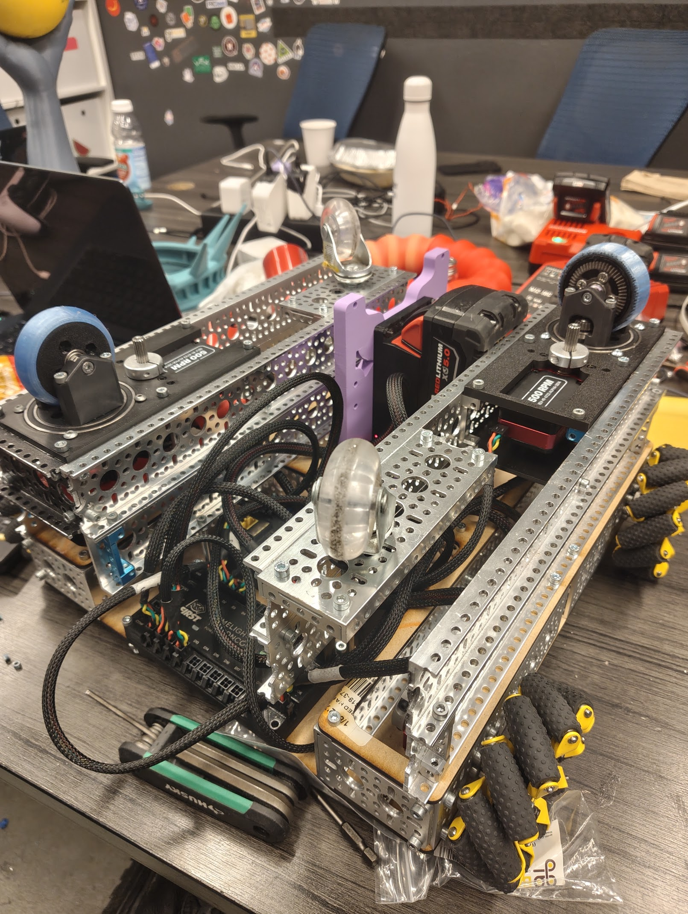
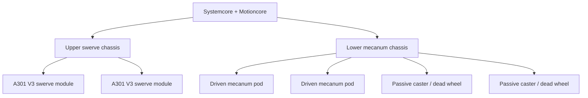
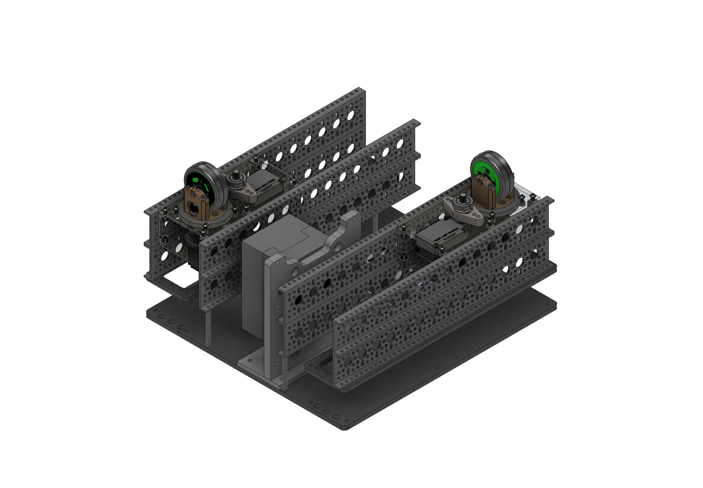
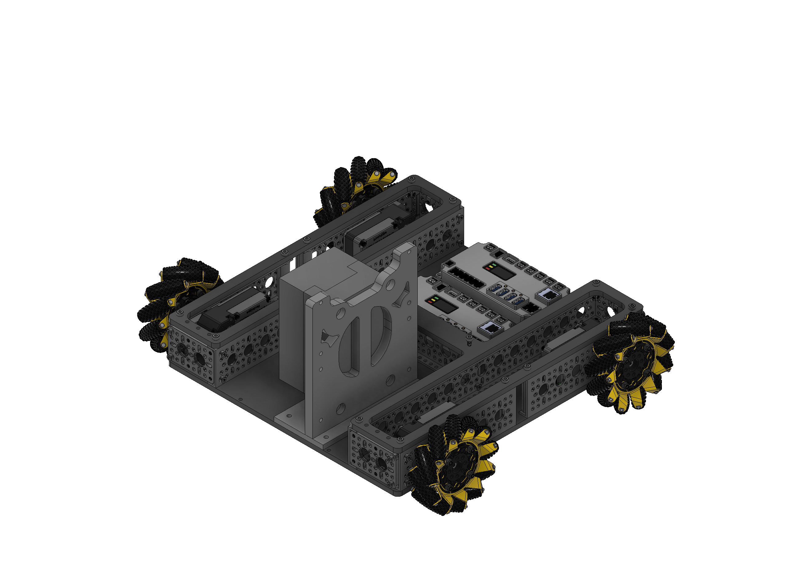
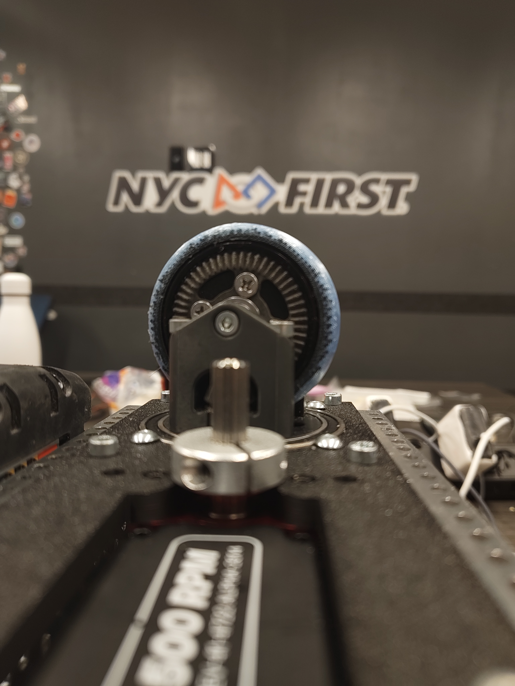
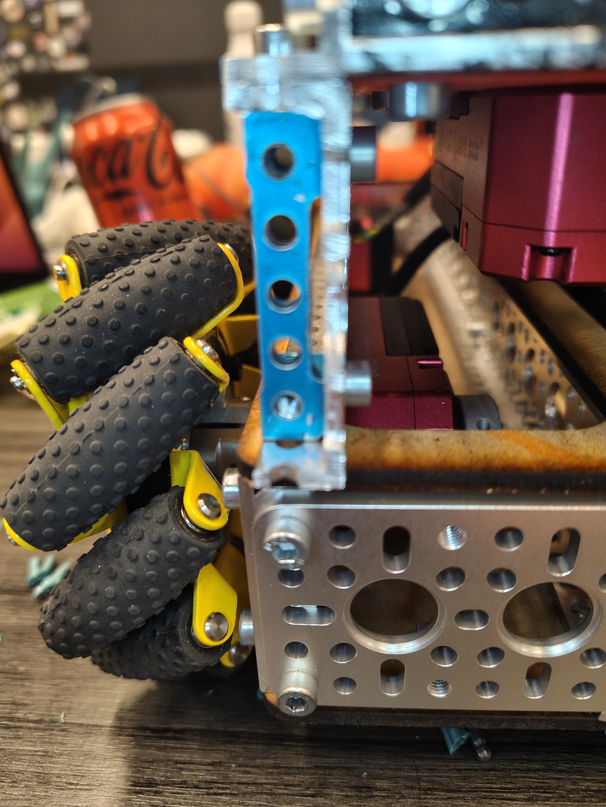
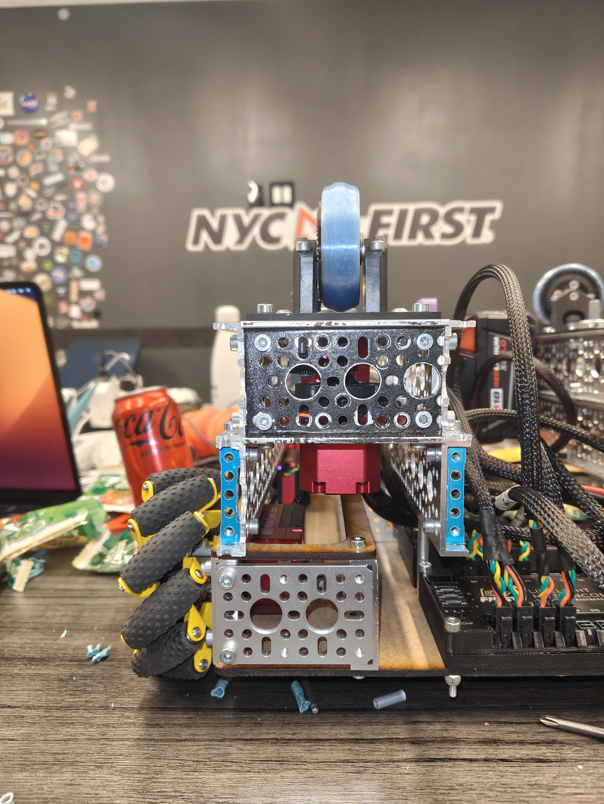
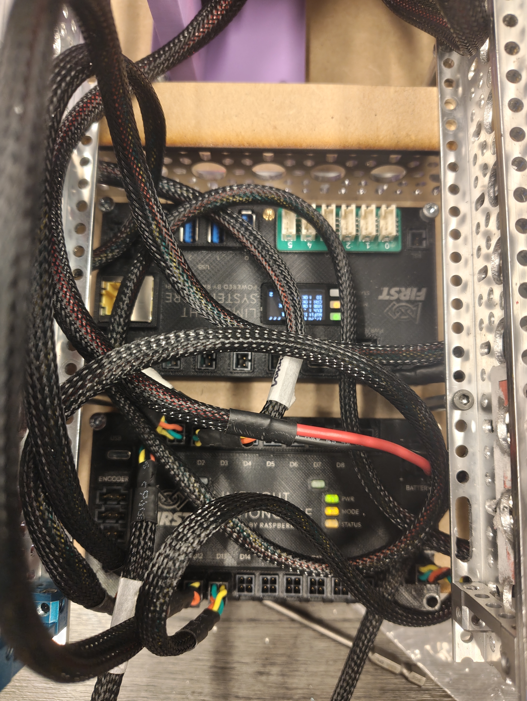

# A301 Full Hybrid Chassis

> [!NOTE]
> This folder documents the full A301 prototype chassis used for Systemcore, Motioncore, and A301 testing. The chassis combines an upper swerve section with a lower mecanum section in one experimental platform.

## ▶ Full Chassis Prototype Video

> **This is a video preview.** Click the image to play it. To keep this page open, use **Ctrl+click** (Windows/Linux), **Cmd+click** (macOS), or middle-click to open the video in a new tab.

## At a Glance

| Area | Detail |
| --- | --- |
| Project | A301 full hybrid chassis |
| Prototype status | Approximately 80% complete |
| Upper drivetrain | Swerve chassis using the current A301 V3 swerve modules |
| Lower drivetrain | A301-powered mecanum chassis |
| Controls | Systemcore and Motioncore |
| Structure | goBILDA channel, plates, and hardware |
| Current prototype panels | Temporary wood/MDF substitutes for final cut panels |
| Current lower-chassis support | Two driven mecanum pods and two passive caster wheels |
| CAD status | Design-reference renders included; final CAD package is not yet released |

## Chassis Architecture

### Upper Swerve Section

The upper portion of the robot uses two instances of the current **A301 V3 swerve module**, which is documented on the main page of the neighboring [`A301 Swerve Module`](../A301%20Swerve%20Module/) folder. Each module uses A301 motors for wheel drive and steering. The upper frame is intended to test the V3 module in a larger combined robot rather than only as a standalone module.

### Lower Mecanum Section

The lower portion is an A301-powered mecanum chassis. Its two active wheel pods provide driven mecanum contact points while the remaining two contact points are currently passive casters.

Only two driven pods are installed on the square portion of the prototype because we did not receive the additional motors/components needed to test another driven-wheel configuration. Two caster wheels are being used in the remaining positions, so they act as **dead wheels**: they support the chassis and roll freely but do not provide drive force.

## Prototype Status

The prototype is about **80% complete**. The main structure is assembled and the combined layout is working as the basis for testing. The current physical chassis is not yet a final implementation of the CAD:

- Some final panels still need to be cut and fitted.
- Wood/MDF pieces are temporarily standing in for those final panels.
- Packaging, cable routing, and structural details will be refined after the replacement panels are installed.
- The CAD should be treated as the intended architecture and a design reference while the physical prototype is improved.
- A final STEP export and Fusion 360 archive will be added after the design is ready to release.

## Full CAD Views

The render above shows the intended combined configuration: the V3 swerve section is mounted above the mecanum base, with Systemcore and Motioncore integrated into the central chassis.

## Prototype Detail Photos

| View | Image |
| --- | --- |
| Full robot / cover view | [Open full resolution](images/full-chassis-prototype-cover.jpg) |
| Systemcore and Motioncore wiring | [Open full resolution](images/systemcore-motioncore-wiring.jpg) |
| Passive caster wheel | [Open full resolution](images/passive-caster-wheel.jpg) |
| Mecanum pod and lower-frame interface | [Open full resolution](images/mecanum-pod-detail.jpg) |
| Upper swerve assembly, front view | [Open full resolution](images/upper-swerve-front.jpg) |

  
  
  

## Files

| File | Purpose |
| --- | --- |
| [`README.md`](README.md) | Chassis overview, architecture, prototype status, and build notes |
| [`images/full-chassis-prototype-cover.jpg`](images/full-chassis-prototype-cover.jpg) | Full physical robot and cover image |
| [`images/systemcore-motioncore-wiring.jpg`](images/systemcore-motioncore-wiring.jpg) | Controls and wiring reference |
| [`images/passive-caster-wheel.jpg`](images/passive-caster-wheel.jpg) | Passive caster/dead-wheel detail |
| [`images/mecanum-pod-detail.jpg`](images/mecanum-pod-detail.jpg) | Mecanum pod and chassis interface |
| [`images/upper-swerve-front.jpg`](images/upper-swerve-front.jpg) | Upper swerve assembly detail |
| [`images/cad-full-chassis.png`](images/cad-full-chassis.png) | Full hybrid chassis CAD render |
| [`images/cad-upper-swerve-section.png`](images/cad-upper-swerve-section.png) | Upper swerve section CAD render |
| [`images/cad-lower-mecanum-section.png`](images/cad-lower-mecanum-section.png) | Lower mecanum section CAD render |
| [`images/cad-mecanum-wheel-out.png`](images/cad-mecanum-wheel-out.png) | Mecanum chassis with an extended wheel pod |

## Build Notes

- The full chassis is an experimental integration platform for Systemcore, Motioncore, A301 motors, the V3 swerve module, and the mecanum base.
- The two caster wheels are temporary passive supports and should not be interpreted as powered or steered modules.
- The current physical build is intentionally documented alongside the CAD so that prototype substitutions and remaining work are visible.
- CAD source files will be published here once the remaining physical revisions are incorporated.
