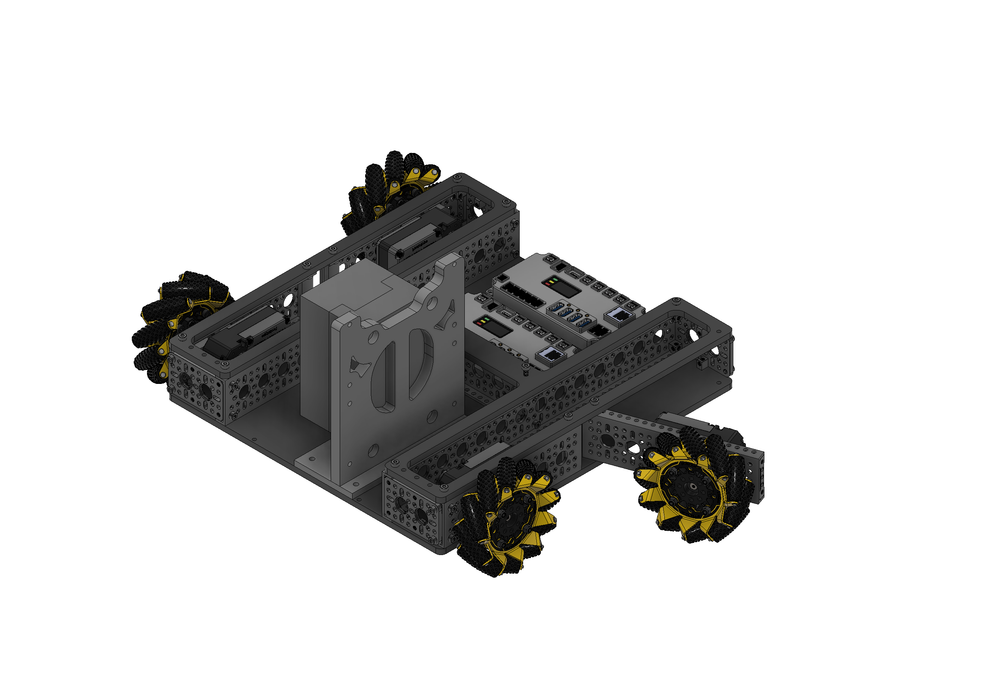

# A301 Mecanum Chassis

### One-week Systemcore and Motioncore drivetrain prototype

A fast mecanum test platform that established the first working drivetrain layout for the internship.

[Read the overview](#project-overview) | [View legacy CAD](#legacy-cad) | [See the timeline](#project-timeline) | [Back to CAD Models](../)

---

## Project Overview

This mecanum chassis was designed and assembled during the first week of the internship. Its purpose was to create a simple working base for early **Systemcore and Motioncore** testing with A301 motors and the **18-volt battery pack**.

The four mecanum wheels allow forward, backward, sideways, diagonal, and rotational movement. Building this platform first gave the team a practical way to test controls, motors, power, packaging, and chassis proportions before moving into the custom swerve work.

| Chassis specification | Mecanum prototype |
| --- | --- |
| Drivetrain | Four-wheel mecanum |
| Original build time | One week |
| Main development stage | Week 1 |
| Controls | Systemcore and Motioncore |
| Motors | A301 |
| Battery | 18-volt pack |
| Early structure | Rapid prototype chassis |
| Final structure | Metal chassis prepared for the nose drawer |

## Drive Behavior

| Wheel coordination | Robot movement |
| --- | --- |
| All wheels drive together | Forward or backward |
| Left and right wheel rollers oppose | Sideways strafing |
| Mixed wheel directions | Diagonal movement |
| Left and right sides oppose | Rotation |

## System Layout

| System path | Purpose |
| --- | --- |
| `18-volt battery pack` -> `Systemcore + Motioncore` -> `A301 motors` | Supplies and controls the drivetrain |
| `A301 motors` -> `Four mecanum wheels` | Produces omnidirectional chassis movement |
| `Metal chassis` -> `Upper mounting surface` -> `Nose drawer` | Supports the final mechanism installation |

## Final Metal Chassis

During the final week of the internship, the chassis parts were cut from metal and assembled into the final physical version. The stronger metal base provided the structure needed to attach the **nose drawer** above the drivetrain.

The mecanum chassis remained its own mini project even after the internship moved toward swerve. It documents the early drivetrain test platform and the final metal base that supported the mechanism work.

## Legacy CAD

The [`Legacy CAD`](<Legacy CAD/>) folder preserves the versioned record of the older repository CAD package. These archived files and records are kept only for project history.

[Download the current mecanum CAD from Google Drive](https://drive.google.com/drive/folders/1Kuxc78ZMYxh6YiVGicnxMk1Pkc9k5txG). The files were moved there because the full Fusion 360 and STEP assemblies are too large for normal GitHub storage.

The reference renders below remain available directly in the repository.

## CAD Gallery

<table>
  <tr>
    <td align="center"> <strong>Full mecanum chassis</strong></td>
    <td align="center"> <strong>Extended wheel configuration</strong></td>
  </tr>
</table>

## Project Timeline

| Stage | Work completed |
| --- | --- |
| Week 1 | Designed and assembled the simple mecanum chassis |
| Early testing | Tested Systemcore, Motioncore, A301 motors, and the 18-volt battery pack |
| Later development | Used lessons from the mecanum platform while developing the custom swerve system |
| Final week | Cut the chassis from metal and prepared the upper surface for the nose drawer |

## Folder Contents

| Folder | Purpose |
| --- | --- |
| [`Legacy CAD`](<Legacy CAD/>) | Versioned archive and source-file status |
| [`images`](images/) | Mecanum CAD renders and future physical-build photos |

## Build Notes

- This was the first complete drivetrain mini project of the internship.
- The one-week build prioritized a working test platform and fast iteration.
- Systemcore and Motioncore were tested with A301 motors and an 18-volt battery pack.
- The final metal version was prepared to carry the nose drawer.
- The project is documented separately from the later swerve and Swechanum work.

---

[Back to the complete CAD Models collection](../)

