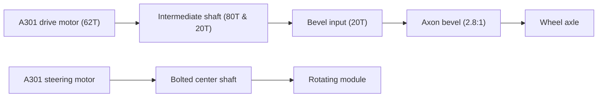

# A301 Swerve Module CAD (V2.5)

> [!NOTE]
> CAD package for V2.5 (Main Version) of the A301-based swerve module used for Systemcore, Motioncore, and A301 testing.

## At A Glance

| Area | Detail |
| --- | --- |
| Drive motor | A301 |
| Steering motor | A301 |
| Structure | goBILDA |
| Drive output | Fully geared transmission (Compact) |
| Steering output | Direct drive via bolted center shaft |
| CAD source | Fusion 360 archive |
| Neutral export | STEP |

## Module Layout

## Drive Gear Path

| Stage | Gear | Notes |
| --- | --- | --- |
| Motor Pinion | 62T | Drive motor output |
| Intermediate 1 | 80T | Driven by 62T motor pinion |
| Intermediate 2 | 20T | Attached to 80T gear, drives next stage |
| Bevel Input | 20T | Driven by Intermediate 2 (20T) |
| Bevel Gear | 2.8:1 | Axon bevel gear set to wheel axle |

## Files

| File | Purpose |
| --- | --- |
| `A301 Swerve Direct turning V2.5.f3z` | Fusion 360 archive |
| `A301 Swerve Direct turning V2.5.step` | STEP export |
| `Screenshot_2024-07-23_225430.png` | Additional CAD render |
| `Screenshot_2024-07-23_225447.png` | Reference CAD image |

## Build Notes

- The module uses one A301 for wheel drive and one A301 for steering.
- The main structure is built around goBILDA hardware.
- The drive path is completely geared. Version 2.5 uses a compact set of gears: a 62T motor gear drives an 80T gear, which has a 20T gear attached to it. That 20T gear drives another 20T gear down to the Axon bevel gears (2.8:1 ratio). This setup allows the pod to be wider but significantly shorter in length.
- The steering path directly drives the rotation of the pod. The shaft goes down to the center and is bolted directly to the pod.

Design Intent

This is the main version (V2.5) of the A301 swerve module. It features improved packaging over V2, offering a shorter and wider footprint while maintaining the direct-driven steering and fully geared drive path.

