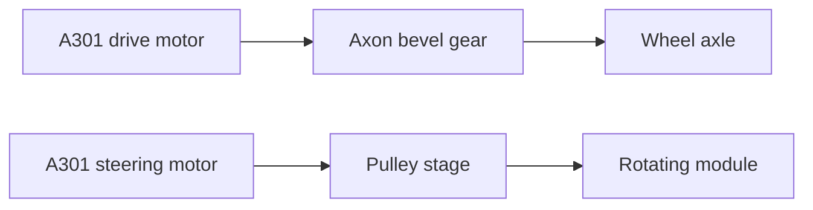

# A301 Swerve Module CAD

> [!NOTE]
> CAD package for an A301-based swerve module used for Systemcore, Motioncore, and A301 testing.

## At A Glance

| Area | Detail |
| --- | --- |
| Drive motor | A301 |
| Steering motor | A301 |
| Structure | goBILDA |
| Drive output | Axon bevel gear |
| Steering output | Pulley-driven module rotation |
| CAD source | Fusion 360 archive |
| Neutral export | STEP |

## Module Layout

## Files

| File | Purpose |
| --- | --- |
| `V1 A301 Swerve Module.f3z` | Fusion 360 archive |
| `V1 A301 Swerve Module.step` | STEP export |
| `Screenshot 2026-07-21 220702.png` | Reference image |

## Pulley Options

| Version | Motor Pulley | Module Pulley | Notes |
| --- | ---: | ---: | --- |
| V1 | 16T | 36T | Metal motor pulley, 3D-printed module pulley |
| V2 | 36T | 36T | Both pulleys are 3D printed |

## Build Notes

- The module uses one A301 for wheel drive and one A301 for steering.
- The main structure is built around goBILDA hardware.
- The drive path uses an Axon bevel gear to transfer motor output to the wheel axle.
- The steering path rotates the module through a pulley stage.

Design Intent

This model is for bring-up and iteration, not a frozen production design. Use the CAD as a reference for A301 packaging, steering geometry, and early swerve-module testing.

