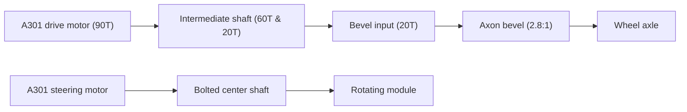

# A301 Swerve Module CAD (V2)

> [!NOTE]
> CAD package for V2 of the A301-based swerve module used for Systemcore, Motioncore, and A301 testing.

## At A Glance

| Area | Detail |
| --- | --- |
| Drive motor | A301 |
| Steering motor | A301 |
| Structure | goBILDA |
| Drive output | Fully geared transmission |
| Steering output | Direct drive via bolted center shaft |
| CAD source | Fusion 360 archive |
| Neutral export | STEP |

## Module Layout

## Drive Gear Path

| Stage | Gear | Notes |
| --- | --- | --- |
| Motor Pinion | 90T | Drive motor output |
| Intermediate 1 | 60T | Driven by 90T motor pinion |
| Intermediate 2 | 20T | Attached to 60T gear, drives next stage |
| Bevel Input | 20T | Driven by Intermediate 2 (20T) |
| Bevel Gear | 2.8:1 | Axon bevel gear set to wheel axle |

## Files

| File | Purpose |
| --- | --- |
| [`A301 Swerve Direct turning (V2).f3z`](<./A301 Swerve Direct turning (V2).f3z?raw=true>) | Fusion 360 archive |
| [`A301 Swerve Direct turning (V2).step`](<./A301 Swerve Direct turning (V2).step?raw=true>) | STEP export |
| [`IMG_20260723_203749662.jpg`](<./IMG_20260723_203749662.jpg?raw=true>) | Reference physical image 1 |
| [`IMG_20260723_203833159.jpg`](<./IMG_20260723_203833159.jpg?raw=true>) | Reference physical image 2 |
| [`IMG_20260723_203846978.jpg`](<./IMG_20260723_203846978.jpg?raw=true>) | Reference physical image 3 |

## Build Notes

- The module uses one A301 for wheel drive and one A301 for steering.
- The main structure is built around goBILDA hardware.
- The drive path is completely geared. The drive motor (90T) connects to a 60T gear, which has a 20T gear attached to it. That 20T gear drives another 20T gear down to the Axon bevel gears (2.8:1 ratio).
- The steering path directly drives the rotation of the pod. The shaft goes down to the center and is bolted directly to the pod.

Design Intent

This model is an older prototype version (V2). It iterates on V1 by replacing the belted steering with a direct-driven bolted center shaft and using a fully geared drive path.

