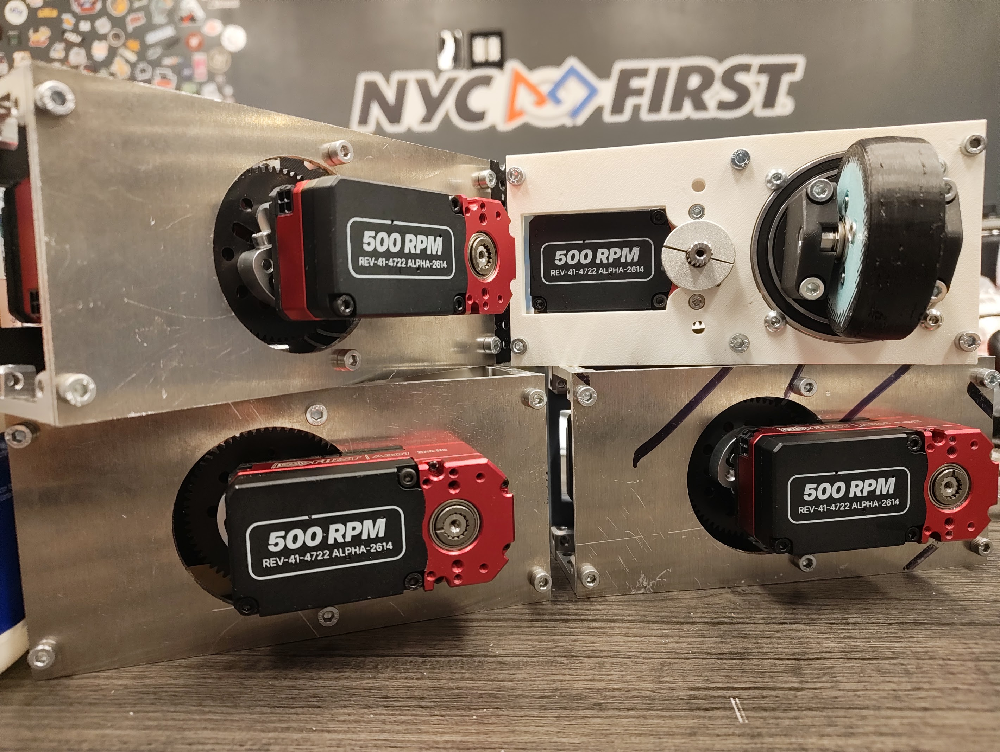
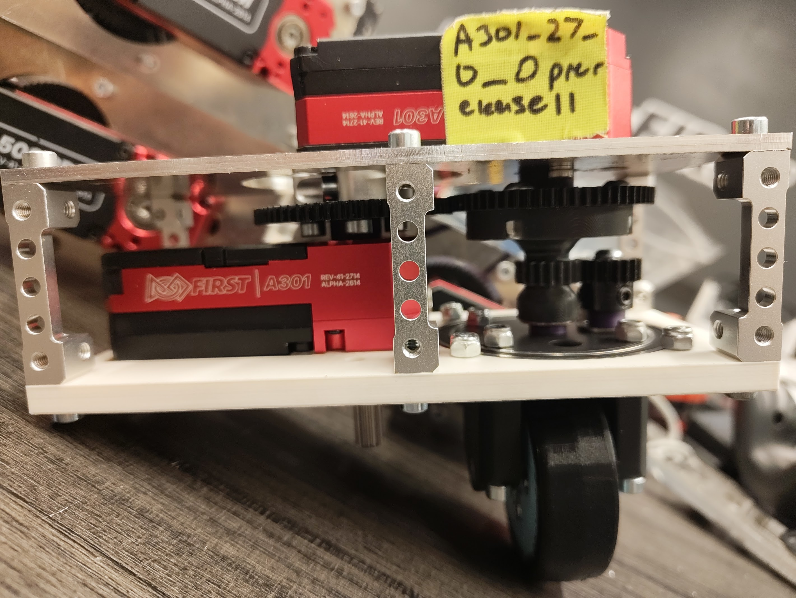
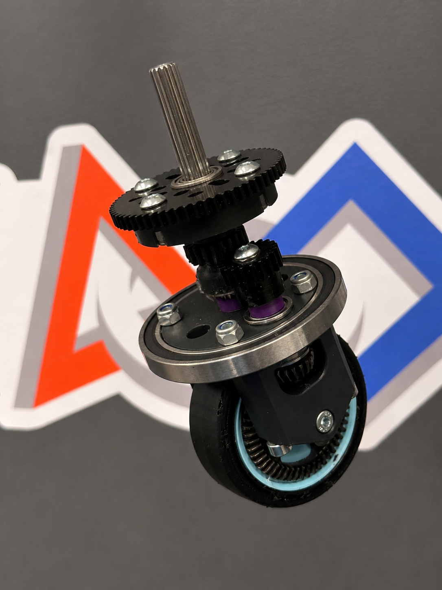

# A301 Swerve Module CAD

### V3.1 CNC-ready drive-and-steer pod for Systemcore and Motioncore testing

The updated custom swerve pod developed after manufacturing and testing the four-module A301 robot.

[Watch the prototype](#prototype-video) | [View CAD](#cad) | [Review the design history](#design-history) | [Back to CAD Models](../)

---

## Prototype Video

> **Click the preview to watch the V3 prototype.** The video opens on YouTube.

## Project Overview

The A301 V3.1 swerve module is a compact two-motor pod designed for the Systemcore robot. One A301 motor drives the wheel through a fully geared transmission, while a second A301 motor rotates the pod directly at its center of rotation.

V3 introduced the slimmer design and replaced the V2.5 Axon 2.8:1 bevel with a 3.1:1 offset bevel set. Four V3 modules were CNC machined and installed on the final robot, using eight A301 motors across the complete swerve assembly. V3.1 keeps that drivetrain layout while correcting the manufacturing tolerances for CNC machining.

The CAD snapshots stored in this repository are now considered legacy versions. The current V3.1 download is presented in the CAD section below.

| Module specification | V3.1 configuration |
| --- | --- |
| Drive motor | One A301 |
| Steering motor | One A301 |
| Motors per pod | Two |
| Structure | goBILDA parts and custom plates |
| Drive output | Fully geared transmission |
| Steering output | Direct rotation at the pod center |
| Overall drive reduction | 3.1:1 |
| Main development period | Weeks 2 through 4 |

## V3.1 CNC Tolerance Update

V3 was CNC machined instead of 3D printed. During assembly, the main bearing hole was too tight, which compressed the bearing fit and prevented the pod from rotating smoothly.

V3.1 is toleranced specifically for CNC machining. The revised bearing-hole fit provides the clearance needed for the bearing to seat correctly and allows the steering pod to rotate smoothly without changing the main drivetrain arrangement.

## Module Layout

| System | Static power path |
| --- | --- |
| Wheel drive | `A301 drive motor (64T)` -> `64T driven gear` -> `20T gear` -> `20T bevel input` -> `3.1:1 offset bevel` -> `Wheel axle` |
| Steering | `A301 steering motor` -> `Center of rotation` -> `Rotating module` |

## Drive Gear Path

| Stage | Gear pair or ratio | Purpose |
| --- | --- | --- |
| First spur stage | 64T to 64T | Transfers drive power at 1:1 |
| Second spur stage | 20T to 20T | Transfers power to the bevel input at 1:1 |
| Bevel stage | 3.1:1 | Turns the power path toward the wheel axle |
| Overall | 3.1:1 | The offset bevel provides the full reduction |

## Print-in-Place Wheel

The wheel and TPU tread are designed to be produced together in one print on a multi-material printer, making tread management easier than the previous bolted-tread design. On FTC mats, this TPU tread also provided a useful traction balance without creating as much friction as rubber tread against the rubber mat.

## Ratchet Status

> [!NOTE]
> The ratchet is not installed on the current physical prototype because it could not be ordered in time for the build. The mounting holes are already included in the module, so the ratchet can be added later without redesigning the main structure.

## CAD

The latest V3.1 CAD is available through the preview below.

  
  
<strong>Current A301 V3.1 Swerve Pod CAD</strong> Click the CAD preview to open the current swerve pod files in Google Drive.

### Current CAD Views

<table>
  <tr>
    <td align="center"> <strong>Underside CAD</strong></td>
    <td align="center"> <strong>Top CAD</strong></td>
  </tr>
</table>

> [!TIP]
> The image opens the current CAD download folder. Older repository CAD versions are available in the archive below.

### CAD Archive

The [`CAD archive`](<Legacy CAD/>) preserves the older V1, V2, V2.25, V2.5, and V3 source packages for design-history reference.

  
  
<strong>Archived A301 V2.5 Swerve Pod CAD</strong> Click the older pod preview to open its repository CAD archive.

| Archived V3 file | Format | Purpose |
| --- | --- | --- |
| [`A301 Ratchet Swerve .75mm inc.f3z`](<Legacy CAD/V3/A301 Ratchet Swerve .75mm inc.f3z>) | Fusion 360 archive | Archived editable V3 module assembly |
| [`A301 Ratchet Swerve .75mm inc.step`](<Legacy CAD/V3/A301 Ratchet Swerve .75mm inc.step>) | STEP | Archived neutral V3 module export |

## Physical Prototype Gallery

<table>
  <tr>
    <td align="center"> <strong>Installed pods</strong></td>
    <td align="center"> <strong>Motors and gearing</strong></td>
    <td align="center"> <strong>Wheel assembly</strong></td>
  </tr>
</table>

## Design History

The module was revised throughout the internship as the team tested packaging, steering, and power transmission. Repository copies are preserved in the [`CAD archive`](<Legacy CAD/>), including [`V1`](<Legacy CAD/V1/>), [`V2`](<Legacy CAD/V2/>), [`V2.25`](<Legacy CAD/V2.25/>), [`V2.5`](<Legacy CAD/V2.5/>), and [`V3`](<Legacy CAD/V3/>).

| Version | Main steering approach | Drive approach |
| --- | --- | --- |
| V1 | Pulley-driven rotation | Axon bevel output |
| V2 | Direct bolted center shaft | Fully geared 2.8:1 Axon bevel path |
| V2.5 | Direct center shaft | Revised geared packaging |
| V3 | Direct motor at the center of rotation | Slimmer fully geared 3.1:1 offset bevel path |
| V3.1 | CNC-toleranced center bearing fit | V3 drivetrain with corrected machining clearance |

## Build Notes

- One A301 powers the wheel and one A301 controls steering.
- The two spur stages remain 1:1, so the offset bevel provides the complete 3.1:1 reduction.
- V3.1 keeps the slimmer V3 package while adding CNC-ready bearing-hole tolerances.
- The steering motor is directly attached at the center of pod rotation.
- Ratchet mounting holes are ready for a future installation.

---

[Back to the complete CAD Models collection](../)

