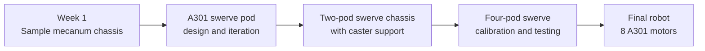

<div align="center">

# Systemcore A301 Robot CAD

### Six weeks of drivetrain design, prototyping, testing, and iteration

[](https://github.com/NYC-FIRST/SystemcoreTesting/tree/Revlib4-testing)
[](https://github.com/NYC-FIRST/SystemcoreTesting/tree/Revlib4-testing)
[](#cad-collection)
[](https://github.com/NYC-FIRST/SystemcoreTesting/tree/Revlib4-testing/testprojects/robot%20test/src/main/java/first/robot)


This folder collects the CAD and build history for the A301 drivetrain prototypes developed during a six-week internship at the NYC FIRST Cornell Tech STEM Center.

[Explore the CAD](#cad-collection) · [Open the robot code](https://github.com/NYC-FIRST/SystemcoreTesting/tree/Revlib4-testing/testprojects/robot%20test/src/main/java/first/robot) · [Watch the final robot](#final-robot-video)

</div>

---

## Project Overview

The project began with a sample mecanum chassis for early Systemcore and Motioncore testing. It then moved through several custom A301 swerve module revisions, an experimental two-pod chassis supported by caster wheels, and finally the complete four-pod swerve robot shown in the Instagram video below.

The final drivetrain uses **four custom A301 V3 swerve pods** and **eight A301 motors**. Each pod has one drive motor and one steering motor. The lower mecanum wheels remain on the hybrid chassis as passive support wheels and use zero motors.

| Final system | Configuration |
| --- | --- |
| Control hardware | Systemcore and Motioncore |
| Powered modules | Four A301 V3 swerve pods |
| Drive motors | Four A301 motors |
| Steering motors | Four A301 motors |
| Total powered motors | Eight |
| Passive support | Four unpowered mecanum wheels |
| Design tools | Fusion 360 and STEP exports |
| Development period | Six-week internship |

## CAD Collection

### 01 · [A301 Swerve Module](<A301 Swerve Module/>)

The complete CAD package for the custom A301 swerve module. The main folder contains **V3**, the slimmer final module used on the current robot, with a Fusion 360 archive, STEP export, reference renders, gearing details, and build notes. Earlier V1, V2, and V2.5 designs are preserved in the `Older Versions` folder to show how the mechanism changed during development.

| Key detail | V3 design |
| --- | --- |
| Motors per pod | One drive and one steering A301 |
| Drive reduction | 3.1:1 offset bevel |
| Steering | Directly attached at the center of rotation |
| Structure | goBILDA parts and custom CAD |

[Open the A301 Swerve Module folder →](<A301 Swerve Module/>)

---

### 02 · [A301 Chassis Swechanum](<A301 Chassis Swechanum/>)

The full hybrid prototype that combines the upper swerve structure with a lower mecanum base. This folder documents both the earlier CAD concept and the updated physical robot. The current build has **four powered swerve pods, zero caster wheels, and zero powered mecanum motors**.

It also includes the current chassis photos, CAD renders, motor allocation, Systemcore and Motioncore layout, and a clickable preview of the final robot video.

[Open the A301 Chassis Swechanum folder →](<A301 Chassis Swechanum/>)

---

### 03 · [A301 Mecanum Chassis](<A301 Mecanum Chassis/>)

The one-week mecanum prototype created during the first week of the internship. It provided a quick platform for testing Systemcore, Motioncore, the A301 motors, and the 18-volt battery pack before the project moved deeper into custom swerve development.

During the final week, the chassis design was cut from metal so the nose drawer could be mounted above it. Its folder is organized for the full chassis CAD files, CAD renders, and real-life build photos.

[Open the A301 Mecanum Chassis folder →](<A301 Mecanum Chassis/>)

## Six-Week Development Path



The CAD folders preserve the mechanical side of this progression. The linked Java project preserves the software developed alongside it, including motor bring-up, individual module tests, the earlier diagonal two-pod drive, mechanism testing, steering calibration, telemetry, field-centric experiments, vision work, and the final four-module drive mode.

## Robot Code

> [!IMPORTANT]
> The code linked below contains the robot work completed throughout the six-week internship. It includes the earlier prototypes as well as the final code used to drive the four-pod swerve robot shown in the Instagram Reel.

### [Open the complete robot code on GitHub →](https://github.com/NYC-FIRST/SystemcoreTesting/tree/Revlib4-testing/testprojects/robot%20test/src/main/java/first/robot)

| Code area | Purpose |
| --- | --- |
| `FourSwerveDriveTeleop.java` | Final four-module swerve driving mode |
| `Robot.java` | A301 motor definitions, four-pod mapping, and robot hardware setup |
| `FourSwerveCalibrationTest.java` | Absolute encoder readings and pod alignment |
| `FourSwerveDriveDirectionTest.java` | Drive motor direction testing |
| `FourSwerveSteeringDirectionTest.java` | Steering direction testing |
| `diagonalswerve/` and `DiagonalTwoPodDriveSubsystem.java` | Earlier two-pod swerve experiments used with caster support |
| `swerveTests/` and pod test modes | Individual drive, steering, encoder, and PID bring-up |
| `ArmJointZeroPidTest.java` | Mechanism motor testing and logging |
| `fieldcentric/`, `vision/`, and telemetry classes | Field-centric, AprilTag, and dashboard experiments |

## Final Robot Video

[](https://www.instagram.com/reel/Db8wJIyBqEo/?utm_source=ig_web_copy_link&igsh=MzRlODBiNWFlZA==)

> **Click the preview to watch the Instagram Reel.** This is the final four-pod swerve robot running the completed drive code linked above.

## Repository Map

```text
CAD Models/
├── A301 Swerve Module/       Current V3 pod and archived module revisions
├── A301 Chassis Swechanum/   Full hybrid chassis, CAD renders, and build photos
├── A301 Mecanum Chassis/     First-week mecanum prototype and chassis CAD
├── Systemcore v Alpha.step   Systemcore Alpha reference model
└── README.md                 Project overview and navigation
```

## Quick Links

| Resource | Link |
| --- | --- |
| Current swerve module CAD | [A301 Swerve Module](<A301 Swerve Module/>) |
| Full hybrid chassis | [A301 Chassis Swechanum](<A301 Chassis Swechanum/>) |
| Mecanum prototype | [A301 Mecanum Chassis](<A301 Mecanum Chassis/>) |
| Six-week Java code | [Robot source on GitHub](https://github.com/NYC-FIRST/SystemcoreTesting/tree/Revlib4-testing/testprojects/robot%20test/src/main/java/first/robot) |
| Final robot video | [Instagram Reel](https://www.instagram.com/reel/Db8wJIyBqEo/?utm_source=ig_web_copy_link&igsh=MzRlODBiNWFlZA==) |
| SystemcoreTesting branch | [Revlib4-testing](https://github.com/NYC-FIRST/SystemcoreTesting/tree/Revlib4-testing) |

---

<div align="center">

Built during the NYC FIRST Cornell Tech STEM Center summer internship using Systemcore, Motioncore, A301 motors, and an iterative CAD-to-hardware workflow.

</div>
