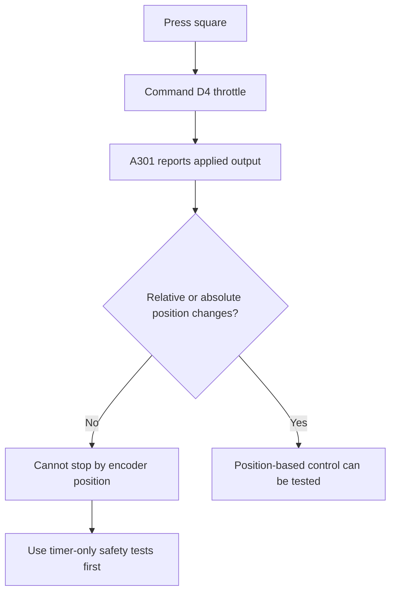

# A301 Arm Joint 0 Encoder Findings

> [!IMPORTANT]
> During bring-up, the `D4` A301 accepted throttle commands, but its relative and absolute encoder signals did not report usable motion data. Until that is fixed, do not rely on encoder-based position control for `armJoint0`.

## At A Glance

| Item | Current State |
| --- | --- |
| Motor object | `armJoint0 = new A301(CANBusMap.CAN_D4)` |
| Firmware target | `27.0.0-prerelease-15` |
| Vendor library | REVLib 4 / `2027.0.0-alpha-4` |
| Firmware update tool | RHC2 |
| Test OpMode | `Arm J0 Relative Throttle` |
| Log file | `/home/systemcore/deploy/arm_joint0_log.csv` |
| Current confidence in relative encoder | Low |
| Current confidence in absolute encoder | Low |

## Test Setup

The `armJoint0` test was created as a separate OpMode so the D4 motor can be tested without mixing arm debugging into the drivetrain OpMode.

| Setting | Value |
| --- | --- |
| Start button | Square / west face button |
| Open-loop throttle | `-0.15` |
| Intended travel | `1.0` relative rotation |
| Timeout | `6.0 s` |
| Pause target | `3.0 s` |
| Control approach during this test | Open-loop throttle with encoder logging |

The test was moved away from absolute-position and relative-position commands because the physical behavior did not match the commanded position targets.

```java
public final A301 armJoint0 = new A301(CANBusMap.CAN_D4);
```

## Logged Results

During the logged run, the code did start the sequence and did send a command to the A301:

| Signal | Observed Value | Meaning |
| --- | ---: | --- |
| `lastCommandedThrottle` | `-0.150000` | Our code commanded motion |
| `reportedThrottle` | `-0.150000` | REVLib reported the same throttle request |
| `appliedOutput` | `-0.149988` | The controller reported roughly 15% output |

The sensor values did not look physically believable:

| Signal | Observed Value | Concern |
| --- | ---: | --- |
| `relativePosition` | `486685.3125` | Stayed fixed instead of changing |
| `absolutePosition` | `-0.25` | Stayed fixed instead of changing |
| `velocity` | About `-104000 RPM` | Not realistic for the test |
| `current` | `0.0 A` | Did not show motor load during commanded output |
| Sticky fault | Present | Needs detail from RHC2 or richer logging |
| Sticky warning | Present | Needs detail from RHC2 or richer logging |

> [!NOTE]
> The state machine did reach its timeout and return to `IDLE`. The problem is not that the OpMode failed to run; the problem is that the feedback signals did not provide usable movement information.

## What This Means



At the moment, the D4 A301 should be treated as **not ready for encoder-based motion control**.

That includes:

- Absolute-position moves
- Relative-position moves
- Stop-after-one-rotation logic
- Any PID or closed-loop test that depends on the reported encoder values

## Recommended Next Test

Use a timer-only open-loop test to separate command/stop behavior from encoder reporting.

```text
square pressed
  -> run very low throttle for a short fixed time
  -> stop
  -> pause
  -> run opposite direction for a short fixed time
  -> stop
```

Suggested starting point:

| Step | Action |
| --- | --- |
| 1 | Press square |
| 2 | Run at very low throttle for `0.25 s` |
| 3 | Stop hard |
| 4 | Pause |
| 5 | Run opposite direction for `0.25 s` |
| 6 | Stop hard again |

> [!TIP]
> This verifies whether `setThrottle(...)`, `disable()`, and stop behavior work without depending on the encoder.

## Investigation Checklist

- [ ] Confirm in RHC2 that the physical `D4` A301 shows changing relative encoder values while moving.
- [ ] Confirm in RHC2 that the physical `D4` A301 shows changing absolute encoder values while moving.
- [ ] Confirm that `CANBusMap.CAN_D4` maps to the physical motor being tested.
- [ ] Record the detailed sticky fault and sticky warning information from RHC2.
- [ ] Add raw or detailed fault/warning logging if the REVLib API exposes it.
- [ ] Confirm the A301 is on firmware `27.0.0-prerelease-15` or later.
- [ ] Confirm the project is using REVLib `2027.0.0-alpha-4` or later.

<details>
<summary>Why clearing sticky faults should wait</summary>

Sticky faults and warnings are evidence. Clear them only after recording what they are, otherwise we may lose the clue that explains the strange encoder and velocity reporting.

</details>

## Related Code

| File | Purpose |
| --- | --- |
| `src/main/java/first/robot/Robot.java` | Defines `armJoint0` on `CANBusMap.CAN_D4` |
| `src/main/java/first/robot/ArmJointZeroPidTest.java` | Runs the D4 arm joint test and writes telemetry logs |
| `build.gradle` | Includes the `armJoint0Log` deploy action for retrieving log output |

