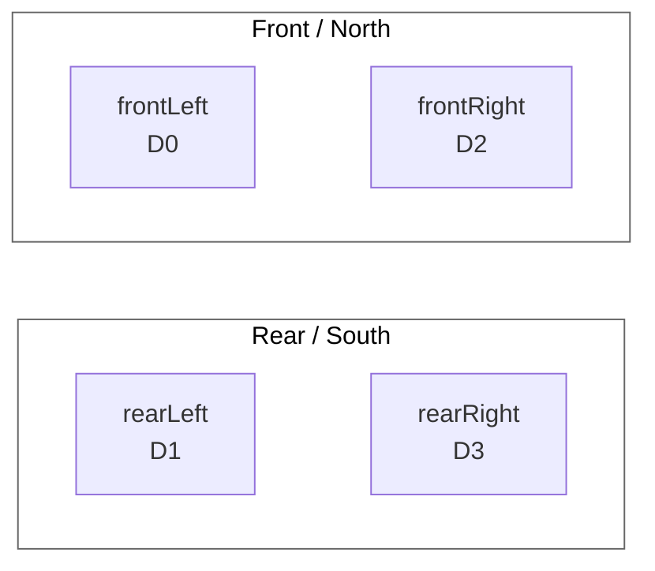

# Mecanum Drive Setup

> [!NOTE]
> This project uses WPILib's `MecanumDrive` helper with four REV A301 motors on Motioncore channels `D0-D3`. The code is currently configured for REVLib 4 / `2027.0.0-alpha-4`.

## At A Glance

| Area | Setup |
| --- | --- |
| Drive helper | `org.wpilib.drive.MecanumDrive` |
| Motor type | REV A301 |
| Front left | `CANBusMap.CAN_D0` |
| Rear left | `CANBusMap.CAN_D1` |
| Front right | `CANBusMap.CAN_D2` |
| Rear right | `CANBusMap.CAN_D3` |
| Right-side inversion | Enabled |
| Teleop OpMode | `DefaultTeleMode` |
| Max output range | `15%` to `50%` |
| Joystick deadband | `0.08` |

## Motor Layout

The drivetrain is defined in `Robot.java`:

```java
public final A301 frontLeft = new A301(CANBusMap.CAN_D0);
public final A301 rearLeft = new A301(CANBusMap.CAN_D1);
public final A301 frontRight = new A301(CANBusMap.CAN_D2);
public final A301 rearRight = new A301(CANBusMap.CAN_D3);

public final MecanumDrive drive = new MecanumDrive(frontLeft, rearLeft, frontRight, rearRight);
```

| Robot Corner | Code Name | Motioncore Channel |
| --- | --- | --- |
| Front left | `frontLeft` | `D0` |
| Rear left | `rearLeft` | `D1` |
| Front right | `frontRight` | `D2` |
| Rear right | `rearRight` | `D3` |



## Motor Inversion

The right-side motors are currently inverted:

```java
frontRight.setInverted(true);
rearRight.setInverted(true);
```

This matches the common drivetrain convention where the motors on opposite sides of the robot face opposite physical directions.

> [!TIP]
> If forward/backward is correct but strafe or rotation is backwards, check the joystick axis signs in `driveCartesian(...)` first. Changing motor inversion affects that wheel in every drive direction.

## Teleop Controls

Teleop control lives in `DefaultTeleMode.java`:

```java
double scale = 0.15 + (0.35 * gamepad.getRightTriggerAxis());
robot.drive.setMaxOutput(scale);
robot.drive.driveCartesian(
    -applyDeadband(gamepad.getLeftY()),
    applyDeadband(gamepad.getLeftX()),
    applyDeadband(gamepad.getRightX()));
```

| Gamepad Input | `driveCartesian` Input | Robot Motion |
| --- | --- | --- |
| Left stick Y | `xVelocity` | Forward/backward |
| Left stick X | `yVelocity` | Strafe left/right |
| Right stick X | `zRotation` | Rotate left/right |
| Right trigger | `setMaxOutput(...)` | Increases allowed speed |
| Hold right bumper | AprilTag assist | Drives toward and aligns with SystemCore's best visible tag |

The left Y value is negated because gamepads usually report forward stick motion as a negative number.

```java
-applyDeadband(gamepad.getLeftY())
```

That makes pushing the left stick forward drive the robot forward.

## Right-Bumper AprilTag Assist

SystemCore owns the Logitech USB camera and publishes detections even during manual driving.
`DefaultTeleMode` subscribes to those results. While the right bumper is held and a fresh tag is visible,
`AprilTagAssistController` temporarily supplies all three mecanum axes:

| AprilTag Measurement | Error / Goal | Mecanum Command |
| --- | --- | --- |
| Range | `range - DESIRED_RANGE_METERS` | Forward/backward |
| Yaw | Tag face angle relative to the camera | Left/right strafe |
| Bearing | Tag direction relative to camera center | Counterclockwise/clockwise turn |

This is the proportional-control pattern used by the FTC SDK
`RobotAutoDriveToAprilTagOmni` sample. Each error is multiplied by a named gain and capped by a
named maximum in `AprilTagAssistController`.

- If no fresh tag is visible while the bumper is held, the drivetrain stops rather than driving
  blind.
- Releasing the bumper immediately returns control to the joysticks and right-trigger speed scale.
- Live measurements, errors, and commands are published under
  `Elastic/AprilTag Assist` in NetworkTables.
- The robot log prints `RIGHT BUMPER PRESSED` and the camera topic state on every press. This
  distinguishes a controller/button problem from a missing or stale vision pose.
- SystemCore's `limelightsc0` service owns the USB camera. Robot code reads its processed result
  through Limelight's Classic NetworkTables API; it must not open `/dev/video0` through
  `CameraServer`.

Configure and calibrate the camera, AprilTag family, tag size, and robot-to-camera transform in the
SystemCore vision interface. In the pipeline's **Output & Crosshair** tab, set **Use Classic NT
API?** to **Yes**. Current SystemCore firmware publishes the result as
`/<camera>/results_msgpack`; the assist discovers that table automatically and decodes the selected
fiducial's ID and `t6t_rs` robot-space pose. Standard Limelight `tv`, `tid`, and
`targetpose_robotspace` topics remain supported as a fallback, so no camera nickname is required.

## Speed Limiting

During bring-up, the robot intentionally runs below full power:

```java
double scale = 0.15 + (0.35 * gamepad.getRightTriggerAxis());
robot.drive.setMaxOutput(scale);
```

| Right Trigger | Max Output |
| ---: | ---: |
| Released | `15%` |
| Half pressed | About `32.5%` |
| Fully pressed | `50%` |

> [!IMPORTANT]
> Keep this limit low while validating wheel direction, strafe behavior, and rotation behavior.

## Deadband

Small joystick values near zero are ignored so the robot does not creep.

| Location | Deadband |
| --- | ---: |
| `Robot.java` | `drive.setDeadband(0.08)` |
| `DefaultTeleMode.java` | `applyDeadband(...)` returns `0.0` below `0.08` |

## Direction Debugging

Use small inputs and test one movement at a time.

| Test | Input | Expected Motion | If It Is Backwards |
| --- | --- | --- | --- |
| Forward | Push left stick forward | Robot drives forward | Check left Y sign |
| Strafe | Push left stick right | Robot strafes right | Check left X sign |
| Rotate | Push right stick right | Robot rotates clockwise | Check right X sign |

### Flip Only Strafe

```java
robot.drive.driveCartesian(
    -applyDeadband(gamepad.getLeftY()),
    -applyDeadband(gamepad.getLeftX()),
    applyDeadband(gamepad.getRightX()));
```

### Flip Only Rotation

```java
robot.drive.driveCartesian(
    -applyDeadband(gamepad.getLeftY()),
    applyDeadband(gamepad.getLeftX()),
    -applyDeadband(gamepad.getRightX()));
```

### Flip Only Forward/Backward

```java
robot.drive.driveCartesian(
    applyDeadband(gamepad.getLeftY()),
    applyDeadband(gamepad.getLeftX()),
    applyDeadband(gamepad.getRightX()));
```

<details>
<summary>When to change motor inversion instead</summary>

Change motor inversion when an individual wheel spins opposite from what it should during single-wheel testing.

Change joystick signs when the drivetrain moves correctly in one axis but a whole movement direction, such as strafe or rotation, feels reversed.

</details>

## Bring-Up Checklist

- [ ] Confirm each wheel is connected to the expected Motioncore channel.
- [ ] Confirm right-side inversion makes forward drive correct.
- [ ] Confirm left stick Y drives forward/backward.
- [ ] Confirm left stick X strafes left/right.
- [ ] Confirm right stick X rotates left/right.
- [ ] Keep output limited while validating controls.
- [ ] Increase output only after all directions are predictable.

## Related Code

| File | Purpose |
| --- | --- |
| `src/main/java/first/robot/Robot.java` | Defines A301 drive motors, inversion, and `MecanumDrive` |
| `src/main/java/first/robot/DefaultTeleMode.java` | Maps gamepad input to `driveCartesian(...)` |
| `src/main/java/first/robot/DefaultAutoMode.java` | Pulses drive motors for basic bring-up testing |
